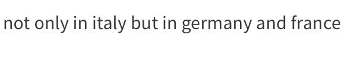
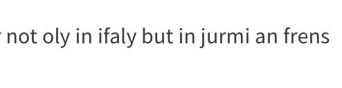

# Homework #1: ASR

Модель, взятая за основу: DeepSpeech2

CER на test-clean: `0.260732`

WER на test-clean: `0.618628`


## Как вопспроизвести модель

#### 1. Настраиваем виртуальное окружение
Из корня проекта:
```bash
virtualenv --python=python3.8 venv
source venv/bin/activate

# нужно установить эту штуку перед тем, как устанавливать другие пакеты
pip install pybind11

pip install -r requirements.txt

# очень быстрая и удобная библа, но нет pip-пакета :c
git clone --recursive https://github.com/parlance/ctcdecode.git
cd ctcdecode && pip install . && cd ..
```

#### 2. Скачать артефакты (веса модели и lm)
Из корня проекта:
```bash
./download_artifacts.sh
```

#### 3. Запустить тест модели на librispeech test-clean
Из корня проекта:
```bash
./test.sh
```

#### 4. Обучить модель с нуля
Из корня проекта:
```bash
./train.sh
```

## Логи тренировки модели

#### Stage 1 (LJSpeech)


 


#### Stage 2 (Librispeech train-clean-360)


 


## Что было перепробовано:

1.  Разное количество RNN-слоев. Остановился в итоге на 3х (меньше -- хуже качество, больше -- либо не хватает памяти (учил на домашней гпу), либо невероятно долго обучать).
2.  Разные `hidden_size` в RNN и линейных слоях сетки. В итоге решил, что будет лучше взять параметры из оригинальной модели: https://nvidia.github.io/OpenSeq2Seq/html/speech-recognition/deepspeech2.html.
3.  Пробовал по рекомендации из описания дз обучаться сначала на LJSpeech, потом файньюниться на LibriSpeech. Если честно, то предобучение помогает только в том, что модель сходу знает что-то структуру языка (сразу прыгает на CTC ~ 1.7), но по качеству не превосходит сетку, обученную с нуля на Librispeech (по крайней мере у меня так получилось).
> Кстати, на LJSpeech я бы выбил оценку 7/10.. (cer около 6%, wer около 28%). Зачем librispeech..
5.  Пробовал разные размеры `beam_size`. Не пробовал размер < 100, сразу начинал со 100. Проверил только, что качетсво при beam_size > 100 такое же, как на 100 (на инференс на всякий случай поставил 200, хуже ведь не будет).
6.  Прикрутил LM-ку вот отсюда: http://www.openslr.org/11. Вот только либо она не работает, либо я чего-то не понял.
7.  По причине медленного обучения переключился на fp16. Кажется качество от этого не падает, по крайней мере на первых k эпохах лоссы одинаково сходятся.

P.S.
Кажется столько времени убил на это, вон даже > 50 коммитов, а рассказать особо нечего...

О том, что было бы сделано, если бы было побольше времени:

1. Предобучение на LibriTTS. В какой-то из статей (не помню какой) говорят, что там покачественнее записи. Есть вероятность, что это помогло бы.
2. Попробовать написать и обучить Jasper/Quartz. В статье про них указано, что можно выбить хорошее качество на 6.7 млн параметрах. А в статье про DeepSpeech2 пишут только про сети порядка 38 млн параметров).
3. Текст перегонять в фонемы, обучаться на них, отдельной сетью перегонять фонемы в графемы. Тоже достаточно перспективно. Судя по логам обучения сети, основная сложность именно в моделировании сложной структуры языка, а не в услышании звуков. Пруф с элементами прикола:

Таргет: 
Предикт: 

4. Сделать более качественный LM-fusion. Например двухэтапный, как в Quartznet. (Опустим момент, что инференс на test-clean будет идти несколько дней, это мелочи...).
