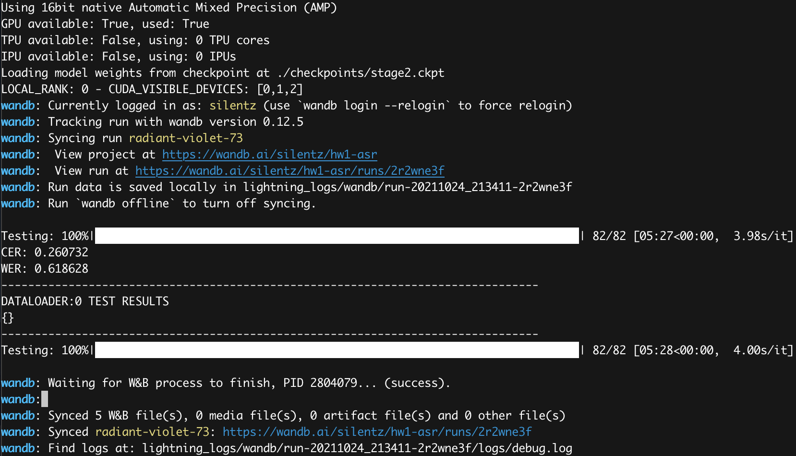
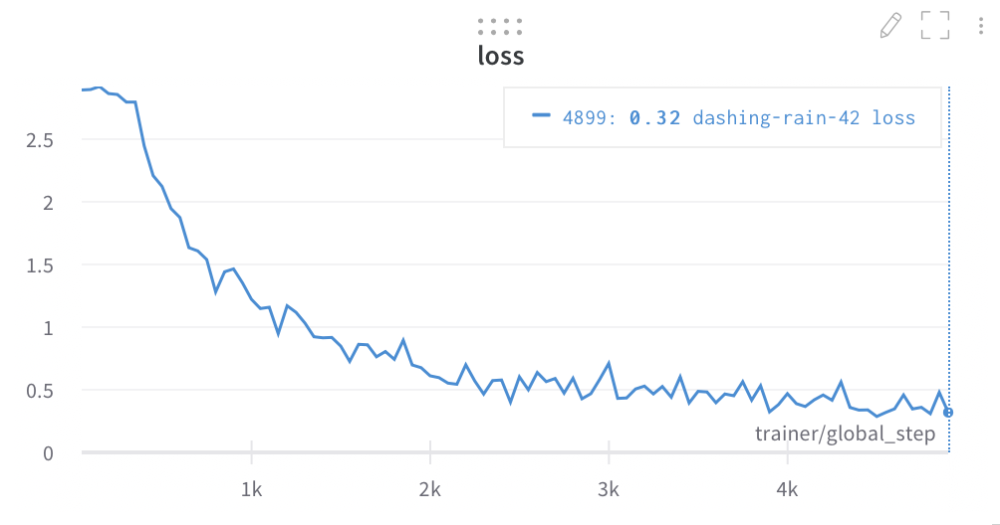
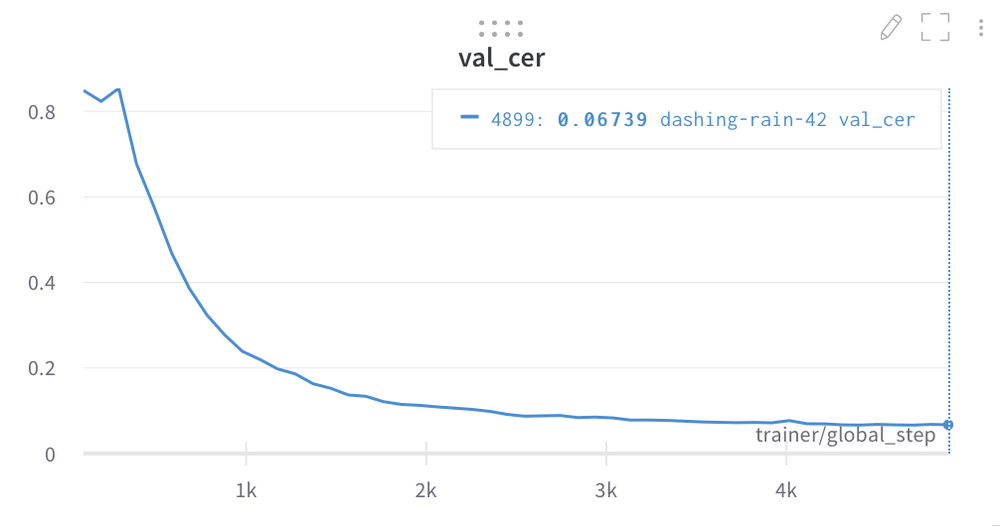
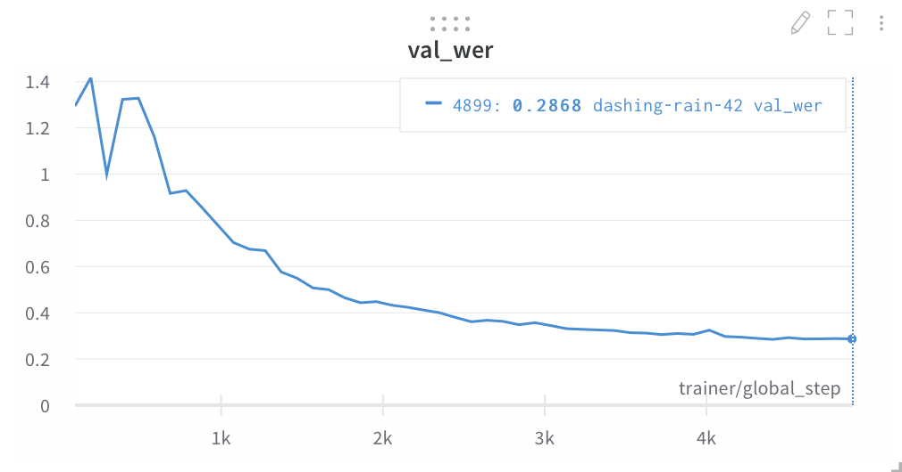
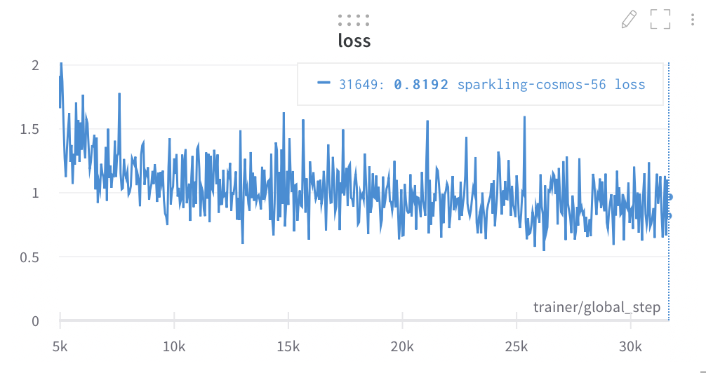
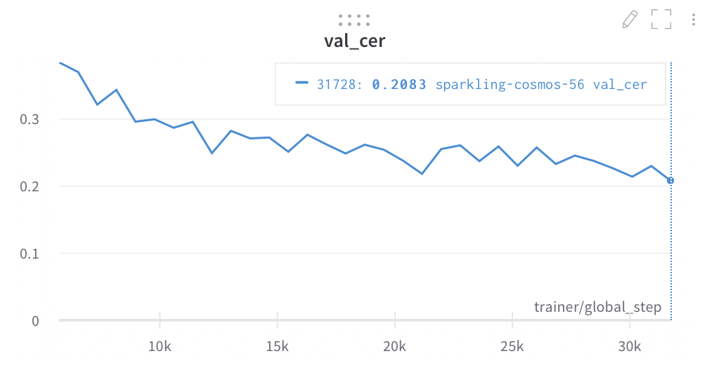
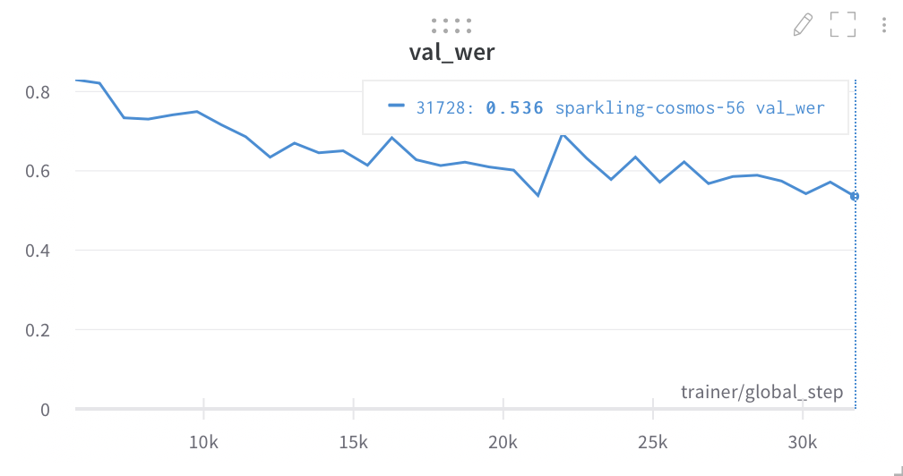

# Homework #1: ASR

Модель, взятая за основу: DeepSpeech2

CER на test-clean: `0.260732`

WER на test-clean: `0.618628`



### Как вопспроизвести модель

#### 1. Настраиваем виртуальное окружение
Из корня проекта:
```bash
virtualenv --python=python3.8 venv
source venv/bin/activate

# нужно установить эту штуку перед тем, как устанавливать другие пакеты
pip install pybind11

pip install -r requirements.txt

# очень быстрая и удобная библа, но нет pip-пакета :c
git clone --recursive https://github.com/parlance/ctcdecode.git
cd ctcdecode && pip install . && cd ..
```

#### 2. Скачать артефакты (веса модели и lm)
Из корня проекта:
```bash
./download_artifacts.sh
```

#### 3. Запустить тест модели на librispeech test-clean
Из корня проекта:
```bash
./test.sh
```

#### 4. Обучить модель с нуля
Из корня проекта:
```bash
./train.sh
```

### Логи тренировки модели

#### Stage 1 (LJSpeech)


 


#### Stage 2 (Librispeech train-clean-360)


 

